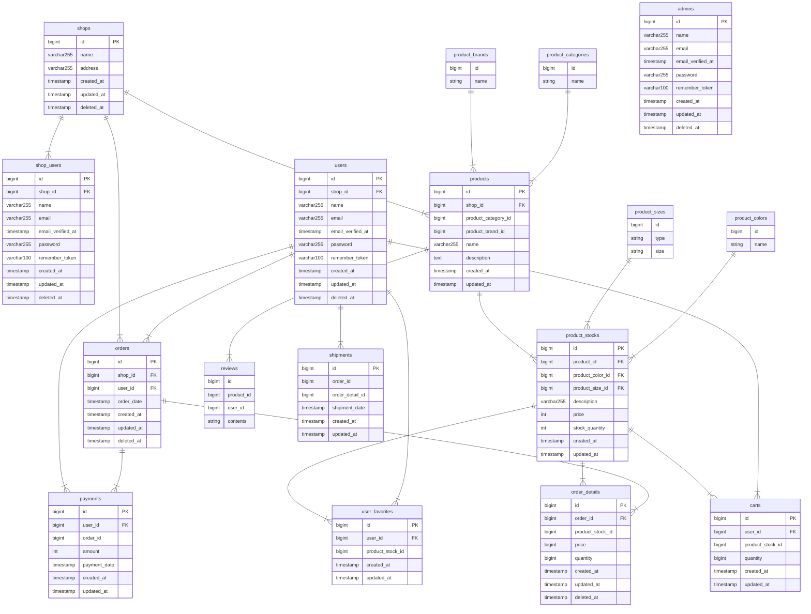

```mermaid
erDiagram
    shops ||--|{ shop_users : ""
    shops ||--|{ products : ""
    shops ||--|{ orders : ""
    products ||--|{ product_stocks : ""
    products||--|{ reviews : ""
    product_sizes ||--|{ product_stocks : ""

    product_brands ||--|{ products : ""
    product_categories ||--|{ products : ""
    product_colors ||--|{ product_stocks : ""

    product_stocks ||--|{ order_details: ""
    product_stocks ||--|{ carts: ""
    product_stocks ||--|{ user_favorites: ""

    users ||-- |{ orders : ""
    users ||-- |{ carts : ""
    users ||--|{shipments : ""
    users ||--|{ payments : ""
    users ||--|{ user_favorites: ""
    
    orders ||--|{ order_details : ""
    orders ||--|{ payments: ""

    users {
	  bigint id PK
	  bigint shop_id FK
	  varchar255 name
	  varchar255 email
	  timestamp email_verified_at
	  varchar255 password
	  varchar100 remember_token
	  timestamp created_at
	  timestamp updated_at
	  timestamp deleted_at
	}

	shop_users {
	  bigint id PK
	  bigint shop_id FK
	  varchar255 name
	  varchar255 email
	  timestamp email_verified_at
	  varchar255 password
	  varchar100 remember_token
	  timestamp created_at
	  timestamp updated_at
	  timestamp deleted_at
	}

    admins {
	  bigint id PK
	  varchar255 name
	  varchar255 email
	  timestamp email_verified_at
	  varchar255 password
	  varchar100 remember_token
	  timestamp created_at
	  timestamp updated_at
	  timestamp deleted_at
	}


	products {
	  bigint id PK
	  bigint shop_id FK
	  bigint product_category_id
      bigint product_brand_id
      varchar255 name
      text description
	  timestamp created_at
	  timestamp updated_at
	}	

	product_stocks {
	  bigint id PK
	  bigint product_id FK
      bigint product_color_id FK
      bigint product_size_id FK
      varchar255 description
      int price
      int stock_quantity
	  timestamp created_at
	  timestamp updated_at
	}

    product_brands{
      bigint id
      string name
    }

    product_categories{
      bigint id
      string name
    }

    product_colors{
      bigint id
      string name
    }

    product_sizes{
      bigint id
      string type
      string size
    }

    reviews{
      bigint id
      bigint product_id
      bigint user_id 
      string contents 
    }

    shops {
	  bigint id PK
	  varchar255 name
      varchar255 address
	  timestamp created_at
	  timestamp updated_at
	  timestamp deleted_at
	}

    orders {
      bigint id PK
      bigint shop_id FK
      bigint user_id FK
      timestamp order_date
      timestamp created_at
      timestamp updated_at
      timestamp deleted_at
    }

    order_details {
      bigint id PK
      bigint order_id FK
      bigint product_stock_id
      bigint price
      bigint quantity
      timestamp created_at
      timestamp updated_at
      timestamp deleted_at
    }

    carts {
      bigint id PK
      bigint user_id FK
      bigint product_stock_id
      bigint quantity
      timestamp created_at
      timestamp updated_at
    }

    user_favorites {
      bigint id PK
      bigint user_id FK
      bigint product_stock_id
      timestamp created_at
      timestamp updated_at
    }

    payments {
      bigint id PK
      bigint user_id FK
      bigint order_id
      int amount
      timestamp payment_date
      timestamp created_at
      timestamp updated_at
    }

    shipments {
      bigint id PK
      bigint order_id
      bigint order_detail_id
      timestamp shipment_date
      timestamp created_at
      timestamp updated_at
    }
```
